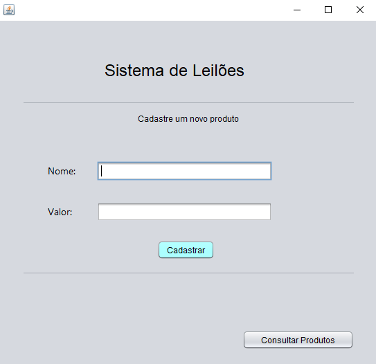
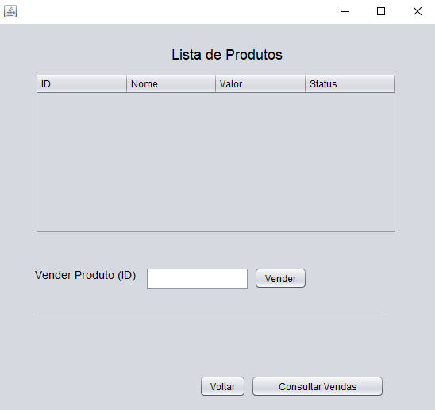

# README aplicativo de leilão

## Conteudos

- [Descrição](#Descrição)
  - [Screenshot](#screenshot)
  - [Links](#links)
  - [Construido com](#Construido-com)

# Descrição

Criados as primeiras funções do sistema, a tela de cadastro que conta com dois campos, um para o nome do produto e outro para seu valor, dois botões, um para executar o cadastro do produto informado e outro  para consultar os produtos já cadastrados. Este segundo botão abre a segunda tela criada que trata-se da tela de listagem, esta tela possui uma tabela na qual serão mostradas as informações dos produtos cadastrados, inclusive seu Status que informa se o produto já foi vendido ou ainda está disponível, esta tela também possui um campo para informar o ID de um produto para a venda e o botão "Vender" para executar a venda. Também foram criados mais dois botões, "Voltar" que fecha a tela de listagem e volta para a tela de cadastro e "Consultar Vendas" que exibirá as vendas efetuadas.

### Screenshot

### Links

- Solution URL: [Meu Repositório Github](https://github.com/jhonRPdoe/atividade_1_uc_11_SENAC.git)

### Construido com

- Java
- Java Swing
- MySql
